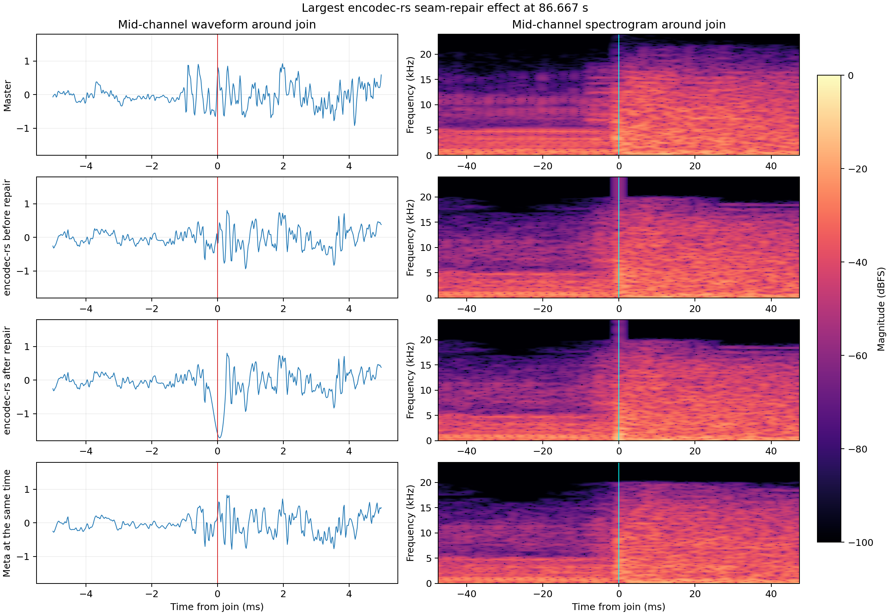
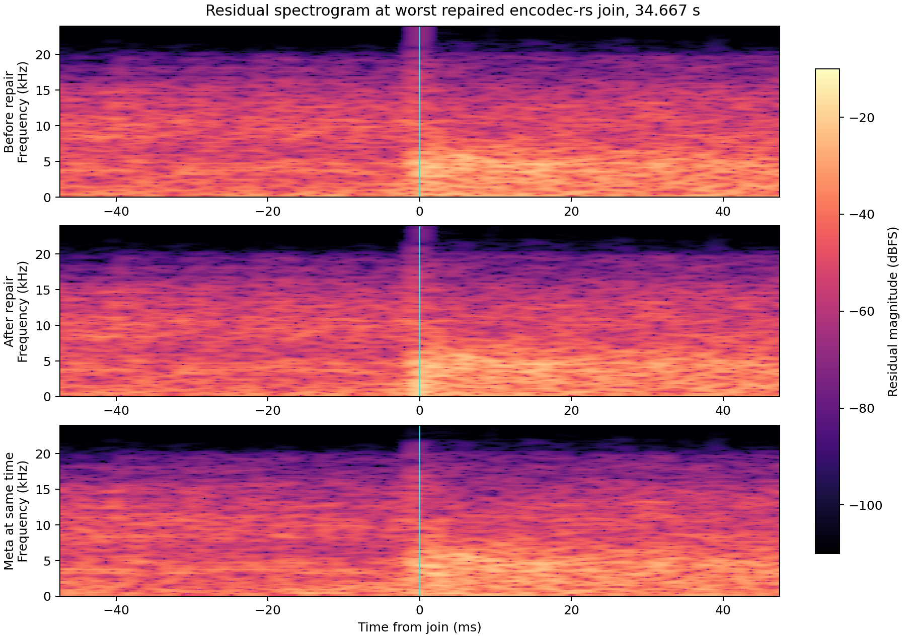
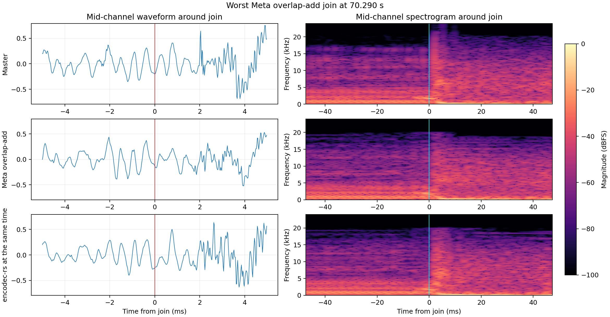

# encodec-rs

`encodec-rs` encodes and decodes EnCodec audio with deterministic, independently framed ECDC chunks.

The current profiles support 48 kHz stereo audio at 6 kbps or 12 kbps.

The release browser path does not use ONNX Runtime, WebGPU, or Python.

It uses one CPU thread and WASM SIMD.

## Runtime architecture

| Work | Release browser implementation |
|---|---|
| Neural encoder and decoder | Custom C kernels compiled to WASM SIMD |
| Neural weights | Packed `float32` blobs |
| Quantized language model | Rust WASM |
| Arithmetic coding | Rust WASM |
| ECDC framing and CRC32 | Rust WASM |
| Guard cropping and optional triangle overlap | Rust WASM |

The custom kernels implement EnCodec convolutions, recurrent layers, normalization, and residual vector quantization.

The kernels contain no track-specific values. One bundle works with all valid audio for its profile.

The build reads fixed ONNX models only to extract model structure and weights.

The release bundles contain no ONNX files. They do not load ONNX Runtime Web.

The packed weights replace the ONNX weights. They are not an additional model copy.

The package also removes approximately 17.7 MB of uncompressed ONNX Runtime Web payload.

The optional native `onnx` feature remains available for comparison and compatibility.

## Experimental Mobile Safari WebGPU backend

The experimental WebGPU backend runs the complete float32 neural encoder and decoder without ONNX Runtime.

Rust WASM continues to run the deterministic LM, arithmetic coder, ECDC framing, and CRC32 operations.

The decoder processes each ECDC chunk in this order:

1. Decode the LM and arithmetic payload.
2. Run the neural decoder with WebGPU.
3. Crop the private model context.
4. Deliver the owned planar PCM.

The callback also receives the complete guarded model window.

The caller can use that window for optional seam repair.

The runtime does not retain complete PCM unless the caller requests it.

The full-track physical iPhone test used Safari 26.5.2.

| Operation | Neural time | LM entropy time | Total time | RTFx |
|---|---:|---:|---:|---:|
| Encode | 58.916 s | 34.404 s | 93.320 s | 2.442× |
| Incremental decode | 55.266 s | 34.297 s | 90.389 s | 2.521× |

The test delivered all 171 chunks of a 227.863-second song.

The first playable chunk was ready in 498 ms after prewarm.

Cold decoder setup took 32.812 seconds.

Applications must prewarm and retain this backend.

All 277,704 encoder codes matched the frozen reference.

The ECDC file size did not change.

The four-second decoder gate measured 80.136 dB SNR against frozen decoded PCM.

See [the WebKit WebGPU benchmark](docs/benchmarks/webkit-webgpu-20260822/README.md) for details.

## Apple MLX backend

The Apple package provides complete ECDC encoding and decoding without ONNX Runtime.

MLX runs the neural encoder and decoder on Metal.

Rust owns deterministic q8 language-model inference, arithmetic coding, ECDC framing, and CRC32.

The MLX bundles contain `encode_frame.safetensors`, `decode_frame.safetensors`, and `lm_weights_q8.bin`.

They do not contain or load ONNX models at runtime.

One initialized backend can process many files.

iOS uses one neural frame per call by default. This setting avoids the memory pressure measured with larger device batches.

macOS groups up to eight compatible neural frames by default.

Callers can override either default.

Call `prewarm(frameBatchSize:)` before the first timed operation.

Use the same batch size for prewarm and normal operation.

Fixed-context in-memory decoding writes borrowed MLX windows directly to the final interleaved PCM buffer.

Fixed-context file decoding writes the same windows directly to planar PCM.

These paths do not allocate an intermediate complete planar track.

The Apple CLI accepts RIFF PCM16, packed PCM24, PCM32, and float32 input.

It also accepts PCM and float `WAVE_FORMAT_EXTENSIBLE` files.

It does not resample. Current profiles require 48 kHz stereo input.

Build the Rust bridge, Swift runtime, executable, and MLX Metal library with:

```bash
scripts/build-apple-mlx.sh
```

### Apple performance

The Apple tests used the same 227.863-second master and 12 kbps, 1333 ms profile.

| Runtime | Device path | Batch | Encode RTFx | Decode RTFx |
|---|---|---:|---:|---:|
| Custom WASM | Apple M1 CPU | 1 | 2.922× | 3.121× |
| MLX | Apple M1 Metal | 8 | 8.136× | 7.252× |
| MLX | Physical iPhone Metal | 1 | approximately 7× | approximately 5× |

The iPhone row records the rounded values shown by the dedicated full-track device runner.

Batch-one MLX decoding matched the frozen PCM bit-for-bit on macOS.

Batch-eight decoding measured 111.27 dB SNR, 0.000000596 RMSE, and 0.000202447 maximum error against that output.

MLX encoding produced the same ECDC bytes at batch one and batch eight.

Decode remains slower on iPhone because it runs serial q8 entropy decoding before neural synthesis.

## Performance result

The August 2026 audit used an Apple M1 host and one WASM thread.

The full-file test used a 227.863-second, 48 kHz stereo PCM24 master.

Higher RTFx is faster. `RTFx = audio duration / wall time`.

### Encoding

| Path | Model time | Total time | RTFx | Result |
|---|---:|---:|---:|---|
| Paired ONNX-WASM control | 53.149 s | 79.090 s | 2.881× | Exact reference |
| Custom WASM encoder | 50.699 s | 76.623 s | 2.974× | Byte-identical ECDC |

The custom encoder reduced paired model time by 4.6%.

It reduced paired total time by 3.1%.

The first direct scalar baseline reached approximately 1.58× realtime.

The current path reaches 2.97× realtime, which is approximately 88% more throughput.

Exact Rust entropy optimizations reduced full-track encode time from 31.304 seconds to 25.831 seconds.

That entropy change reduced the stage time by 17.5% without changing a payload byte.

### Decoding

The decoder audit bracketed the ONNX control with two custom runs.

| Path | Model time | Total time | RTFx |
|---|---:|---:|---:|
| Custom WASM A | 49.817 s | 76.612 s | 2.974× |
| ONNX-WASM control | 149.130 s | 175.174 s | 1.301× |
| Custom WASM B | 46.752 s | 73.452 s | 3.102× |

The second custom run made model execution 3.19 times faster.

It made complete warm decoding 2.39 times faster.

Exact Rust entropy optimizations reduced full-track decode time from 31.286 seconds to 25.433 seconds.

That entropy change reduced the stage time by 18.7%.

### Browser control

Headless Chrome 151 processed three warm frames with single-thread WASM.

| Browser decoder | Setup | Median model time | Model RTFx |
|---|---:|---:|---:|
| ONNX Runtime Web | 514.1 ms | 1,075.2 ms | 3.72× |
| Custom WASM | 280.2 ms | 851.1 ms | 4.70× |

The custom browser decoder was 1.263 times faster for model execution.

The production package completed an ONNX-free browser encode and decode round trip.

The encoder produced the exact 4,589-byte reference ECDC file.

The decoder produced bit-identical PCM for that four-second test.

## Numerical parity

The custom encoder produces the same codes, scale, and ECDC bytes as the ONNX-WASM control.

The full-track ECDC SHA-256 is:

```text
35cd76f783228d79268cbc2ced6901baf37874c571598cbc32098485de1721c4
```

The full custom decoder measured 85.363 dB SNR against the ONNX-WASM decoder.

Both paths had the same frame count, RMS, peak, and clipping count.

One unusual frame caused most of the full-track numerical difference.

Standard SIMD improved parity but reduced speed. The release therefore selects relaxed SIMD when the browser supports it.

The runtime falls back to standard WASM SIMD when relaxed SIMD is unavailable.

## Supported fixed profiles

| Bundle | Rate | Owned samples | Model samples | LM steps | Codebooks |
|---|---:|---:|---:|---:|---:|
| `encodec_48khz_6kbps_1333ms` | 6 kbps | 64,000 | 64,960 | 203 | 4 |
| `encodec_48khz_12kbps_1333ms` | 12 kbps | 64,000 | 64,960 | 203 | 8 |
| `encodec_48khz_6kbps_1800ms` | 6 kbps | 86,400 | 87,360 | 273 | 4 |
| `encodec_48khz_12kbps_1800ms` | 12 kbps | 86,400 | 87,360 | 273 | 8 |

Each model window has 480 guard samples before and after the owned region.

The encoder supplies real source guards when those samples exist.

It supplies zeros at the start and end of a file.

The model always receives its fixed input shape. A short final owned region therefore uses zero padding.

The encoder processes all fixed latent steps. The ECDC chunk records the owned sample count.

## Guards and reconstruction

Guard samples give the neural model real context near each owned boundary.

The low-level decoder returns the complete decoded model window, including both guards.

The standard ECDC assembly crops the guards and concatenates untouched owned PCM.

It does not apply an implicit seam repair.

A caller can instead apply triangle-weighted overlap across adjacent decoded guard windows.

The caller must select this operation explicitly.

The `seam` API provides `triangle_overlap_add_planar_frames` for this purpose.

## State and session reuse

The neural frame encoder and decoder are not stateful between calls.

One initialized runtime can process independent chunks or different tracks in any order.

Session reuse keeps allocations, packed weights, and prepared kernels. It changes speed, not results.

The q8 language model starts with new state for each ECDC chunk.

The runtime clears and reuses the state cache allocation between chunks.

The arithmetic coder also starts with new state for each ECDC chunk.

It does not reset at each code timestep or codebook.

A randomized audit interleaved two tracks through one session.

All 316 interleaved chunk hashes matched their isolated-session hashes.

The browser encoder accepts one fixed model window per call.

Tensor batching did not improve this single-thread workload.

## Difference from official Meta EnCodec

The official Meta CLI accepts a complete file, but its neural model still processes segments.

Its 48 kHz model uses 48,000-sample segments with a 47,520-sample stride.

The 480-sample stride difference creates a 10 ms overlap.

Meta combines decoded segments with triangle-weighted overlap-add.

Meta starts one language-model state and one arithmetic coder for each neural segment.

| Property | `encodec-rs` fixed profile | Official Meta 48 kHz profile |
|---|---|---|
| Long-file unit | 64,000 or 86,400 owned samples | 48,000 model samples |
| Source context | 480 guard samples on each side | 480 adjacent overlap samples |
| Reconstruction | Caller-selected crop or triangle overlap | Triangle overlap-add |
| Entropy reset | Each owned ECDC chunk | Each neural segment |
| Entropy probabilities | Deterministic q8 integer path | Floating-point PyTorch path |
| Segment framing | Explicit length and CRC32 | Expected symbol count |

Meta ECDC version 0 does not store an encoded length or CRC for each neural segment.

Its decoder infers each segment boundary from the expected symbol count.

Floating-point probability differences can change arithmetic bit consumption across architectures.

A changed boundary can make later Meta segments unreadable.

`encodec-rs` contains an arithmetic failure within one length-framed, CRC-protected chunk.

The comparison uses Meta commit `0e2d0aed29362c8e8f52494baf3e6f99056b214f`.

- [Model segmentation](https://github.com/facebookresearch/encodec/blob/0e2d0aed29362c8e8f52494baf3e6f99056b214f/encodec/model.py)
- [Entropy compression](https://github.com/facebookresearch/encodec/blob/0e2d0aed29362c8e8f52494baf3e6f99056b214f/encodec/compress.py)
- [Binary container](https://github.com/facebookresearch/encodec/blob/0e2d0aed29362c8e8f52494baf3e6f99056b214f/encodec/binary.py)
- [Triangle overlap-add](https://github.com/facebookresearch/encodec/blob/0e2d0aed29362c8e8f52494baf3e6f99056b214f/encodec/utils.py)

## ECDC layout

One `.ecdc` file contains one header and one or more independent chunks.

```text
4 bytes   magic: "ECDC"
1 byte    version: 0
4 bytes   metadata JSON length, big-endian u32
N bytes   metadata JSON

repeated chunks:
4 bytes   payload length, big-endian u32
4 bytes   payload CRC32, big-endian u32
M bytes   payload
```

The metadata records the model, audio length, codebook count, LM mode, and q8 weight hash.

Fixed containers record the LM frame length through `fl`.

The q8 entropy path uses bitstream version `acv=2`.

Older raw payloads and floating-point LM payloads are not supported.

Do not concatenate complete ECDC files. One file can already contain many independent chunks.

The current `acv=2` envelope is repository-specific. It is not the proposed Profile 1 container.

## Release bundle layout

Run the release builder to replace `dist/wasm-fixed-bundles`.

```bash
scripts/build_wasm_fixed_bundles.sh
```

The builder uses `/opt/anaconda3/envs/encodec-export/bin/python` by default.

Set `PYTHON_BIN` when the ONNX package exists in another environment.

The builder also requires Emscripten, Rust nightly, and `wasm-bindgen`.

The generated package has this structure:

```text
dist/wasm-fixed-bundles/
  encodec-ecdc-runtime.js
  custom-encoder-runtime.js
  custom-decoder-runtime.js
  manifest.json
  pkg/
    encodec_rs.js
    encodec_rs_bg.wasm
  bundles/<profile>/
    bundle.json
    lm_weights_q8.bin
    manifest.json
    encoder/
      metadata.json
      weights.json
      weights.f32le
      encodec-encoder-relaxed.mjs
      encodec-encoder-relaxed.wasm
      encodec-encoder.mjs
      encodec-encoder.wasm
    decoder/
      metadata.json
      weights.json
      weights.f32le
      encodec-convtranspose-relaxed.mjs
      encodec-convtranspose-relaxed.wasm
      encodec-convtranspose.mjs
      encodec-convtranspose.wasm
```

The manifest records each asset size and SHA-256 value.

## Browser verification

Install the locked browser test dependencies.

```bash
npm ci --prefix browser-smoke
```

Start the local cross-origin-isolated test server.

```bash
PORT=8798 python3 browser-smoke/serve.py
```

Run the packaged encoder lifecycle test.

```bash
BROWSER_BENCH_MODE=runtime-chunk \
node scripts/benchmark-browser-decoders.mjs
```

Run the complete custom encode and decode test.

```bash
BROWSER_BENCH_MODE=roundtrip \
BROWSER_CUSTOM_ENCODER_ROOT=dist/wasm-fixed-bundles/bundles/encodec_48khz_12kbps_1333ms/encoder/ \
BROWSER_CUSTOM_ENCODER_KERNEL=dist/wasm-fixed-bundles/bundles/encodec_48khz_12kbps_1333ms/encoder/encodec-encoder-relaxed.mjs \
BROWSER_CUSTOM_DECODER_ROOT=dist/wasm-fixed-bundles/bundles/encodec_48khz_12kbps_1333ms/decoder/ \
BROWSER_CUSTOM_DECODER_KERNEL=dist/wasm-fixed-bundles/bundles/encodec_48khz_12kbps_1333ms/decoder/encodec-convtranspose-relaxed.mjs \
node scripts/benchmark-browser-decoders.mjs
```

These tests use local headless Chrome. They do not enable WebGPU or browser threading.

## Native ONNX compatibility

Download the source model bundles before you use the optional ONNX CLI.

```bash
scripts/download-onnx-bundles.sh
```

Build the CLI.

```bash
cargo build --release --features onnx
```

Encode one WAV file.

```bash
target/release/encodec-rs onnx-encode \
  onnx-bundles/encodec_48khz_12kbps \
  input.wav output.ecdc
```

Decode one ECDC file.

```bash
target/release/encodec-rs onnx-decode \
  onnx-bundles/encodec_48khz_12kbps \
  input.ecdc output.wav
```

The hosted models require 48 kHz stereo input. The CLI does not resample audio.

## Full-file comparison with official Meta EnCodec

The same Apple M1 host processed the 227.863-second master with one CPU thread.

The Meta core row excludes setup. The Meta CLI row includes process and model setup.

| Path | Encode time | Encode RTFx | Decode time | Decode RTFx | ECDC bytes |
|---|---:|---:|---:|---:|---:|
| Current custom `encodec-rs` | 76.623 s | 2.974× | 73.452 s | 3.102× | 296,562 |
| Meta loaded core API | 104.004 s | 2.191× | 104.171 s | 2.187× | 278,134 |
| Meta standard fresh CLI | 108.605 s | 2.098× | 106.209 s | 2.145× | 278,134 |

The current custom path is faster for complete encoding and decoding on this host.

The `encodec-rs` payload is 6.63% larger than the Meta payload.

This comparison measures complete implementations. It does not isolate Python or FFI overhead.

## Full-file quality

The seamless PCM24 master is the reference for each quality result.

The `encodec-rs` quality row uses untouched owned PCM from the reference decoder.

| Candidate | SNR | SI-SDR | Log-spectral distance | Spectral convergence | Loudness delta |
|---|---:|---:|---:|---:|---:|
| `encodec-rs`, untouched PCM | 6.594 dB | 5.723 dB | 12.524 dB | 0.27869 | -0.410 LU |
| Official Meta | 6.600 dB | 5.719 dB | 12.596 dB | 0.27893 | -0.434 LU |

These aggregate results do not show a material quality difference.

Official ViSQOL scored ten matched, active eight-second excerpts.

| Candidate | Mean MOS-LQO | Median MOS-LQO | Standard deviation |
|---|---:|---:|---:|
| `encodec-rs` | 4.2874 | 4.2809 | 0.0663 |
| Official Meta | 4.2769 | 4.2847 | 0.0676 |

The paired mean difference was `+0.0105` for `encodec-rs`.

Its 95% confidence interval was `-0.0038` to `+0.0248`.

The result does not show a reliable winner.

## Seam analysis

The master has no codec join. Each candidate join uses the same master samples as its reference.

The analysis uses a 20 ms window around each join.

Lower seam excess is better. Higher seam SNR is better.

| Reconstruction | Joins | Median excess | P90 excess | Median seam SNR | Median step error |
|---|---:|---:|---:|---:|---:|
| Cubic Hermite experiment | 170 | 0.587 dB | 3.929 dB | 5.169 dB | 0.02957 |
| Untouched owned PCM | 170 | 0.476 dB | 3.011 dB | 5.245 dB | 0.08958 |
| Triangle guard overlap | 230 | 0.019 dB | 2.099 dB | 6.118 dB | 0.02699 |

Triangle guard overlap produced the best measured join distribution.

Hermite reduced the sample step but degraded master-reference fidelity at 124 of 170 joins.

Hermite also increased the output peak from `+2.552 dBFS` to `+5.190 dBFS`.

The results do not support cubic Hermite for this compressed musical audio.







Python produced the analysis and figures. Runtime reconstruction remains Rust and WASM.

## Library features

Enable container and entropy functions without a neural runtime.

```toml
encodec-rs = { git = "https://github.com/wavey-ai/encodec-rs.git", features = ["ecdc"] }
```

Enable explicit PCM seam operations.

```toml
encodec-rs = { git = "https://github.com/wavey-ai/encodec-rs.git", features = ["seam"] }
```

Enable the optional native ONNX runtime.

```toml
encodec-rs = { git = "https://github.com/wavey-ai/encodec-rs.git", features = ["onnx"] }
```

The `ecdc::FrameCodec` trait separates neural frame execution from ECDC framing.

The project is licensed under the MIT License.
